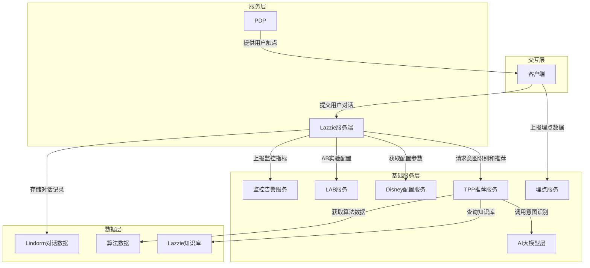
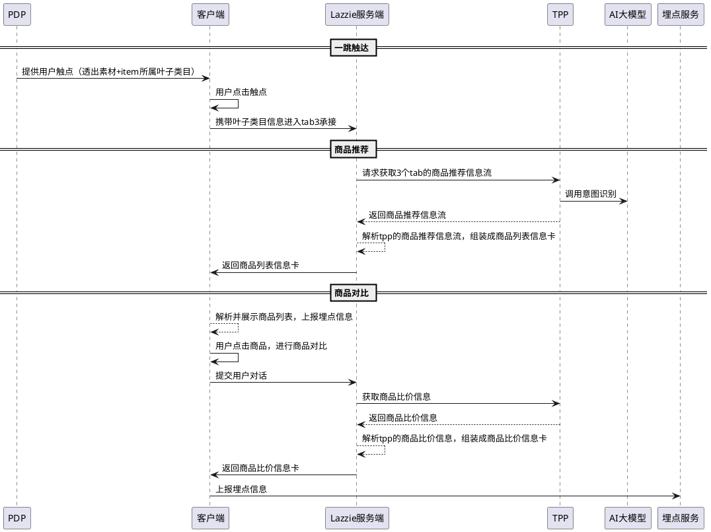
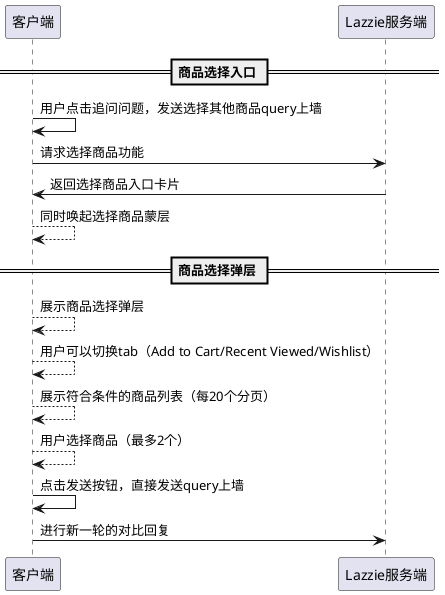
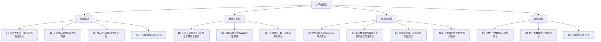
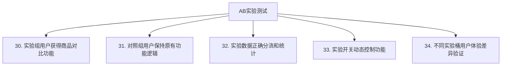

# PDPTooltips增加商品对比分支技术方案

# 背景

突破单场景转化瓶颈，跨场景实现"1+1>2"的流转效率，为用户提供「场景感知型导购」体验，基于用户全站连续行为，叠加过往的被动信息输入（如历史行为或用户静态信息）进行复杂推理分析，实时判断用户意图后在当前场景。

之前已经接入帮我凑、帮我算、帮我选，本次迭代增加帮我比。用户在浏览商品详情页时，常会有"对比其他商品"的潜在意图（如看了多款耳机/洗面奶/手机）。当前行为路径通常是：商详页 → 返回列表页 → 筛选/搜索 → 打开另一个商品 → 手动对比。该路径繁琐，跳出率高。我们希望帮助用户快速完成对比决策，减少跳出、提升成交。

# 技术方案

## 系统架构



**架构说明：**
- **交互层**：客户端负责用户交互和卡片渲染，以及上报埋点，与Lazzie服务端和埋点服务通信
- **服务层**：Lazzie服务端负责用户对话处理（包含业务逻辑处理、频控、AB灰度、通过逻辑代码解析下游返回的内容组装成信息卡），与TPP通信；PDP提供用户触点
- **基础服务层**：埋点服务负责接收并持久化客户端上报的埋点信息，只与客户端通信；TPP推荐工程端负责调用AI大模型进行意图识别，结合算法和知识库进行商品或内容推荐，与Lazzie服务端、AI大模型层、算法、知识库服务通信
- **数据层**：存储Lazzie知识库、算法数据、Lindorm对话数据等

## 关键设计

### 意图识别与触发机制

* **意图预测规则**：
  * 浏览序列中，连续浏览同类商品 ≥2 个，且当前主品的商品停留时间＞3s
  * 收藏、加购了多个同类商品
  * 同类目品判定：直接按照商品是否处于同一个叶子类目选择判定

* **透出策略**：
  * 范围：用户被动触达（PDP tooltips）、用户主动点击（PDP 参数模块）
  * 疲劳度：单自然日1次
  * 对比数量：上限2个（包含主品）
  * 商品类目范围：一期限制部分高决策成本类目

### 商品对比算法

* **数据输入**：商品属性、参数、卖点、价格、评价
* **特征提取**：自动筛选主要差异字段（如功率/成分）
* **权重排序**：根据不同类目偏重打分，调整展示选项
* **模型生成**：以Prompt生成自然语言对比，输出统一格式
* **输出呈现**：简短总结+表格对比+商品卡片

### 商品选择器设计

* **商品来源**：
  * Add to Cart：过滤当前购物车已加购的同叶子类目商品
  * Recent Viewed：过滤当前最近浏览下（最近14天）的同叶子类目商品
  * Wishlist：过滤当前已收藏的同叶子类目商品

* **交互逻辑**：
  * 支持tab切换，展示对应tab下的商品列表
  * 单击选中，再次单击取消选择，最多选择2个商品
  * 选满后发送按钮高亮，支持新一轮对比

## 关键流程

### 商品对比主流程



### 商品选择器流程



# API协议

## Tooltips协议

### 商品对比Tooltips

**tooltipsType**: `product_comparison`

```json
{
  "lazziePushChannel": "local_push",
  "branchType": "product_comparison",
  "activityId": "",
  "msgIdempotentId": "",
  "bizFrom": "pdp-{country}-{itemId}",
  "tooltipsType": "askrec",
  "scene": "page_pdp",
  "sceneInfo": {
    "itemId": "商品ID"
  },
  "data": {
    "text": {
      "title": "Compare with similar products you viewed?",
      "desc": "I found products you recently browsed that are similar to this one. Let me help you compare.",
      "icon": "comparison_icon"
    },
    "buttonView": {
      "text": "Help me compare",
      "desc": "",
      "icon": "compare_icon"
    },
    "itemList": [{
      "tagText": "",
      "title": "Apple iPhone 15 Pro in Blue 256GB",
      "url": "",
      "icon": "",
      "itemId": "商品ID",
      "image": "商品图URL",
      "trackInfo": "",
      "clickTrackInfo": "",
      "itemDiscountPrice": "$999.00",
      "itemPrice": "$1199.00",
      "currency": "$",
      "isCurrencyLeft": "1"
    }],
    "extraParams": "推转问标题作为用户prompt文本",
    "url": "跳转到lazzie二级承接页的URL"
  },
  "trackInfo": "埋点信息",
  "clickTrackInfo": "点击埋点信息"
}
```

## 商品对比结果协议

### 商品对比卡片

**cardType**: `product_comparison_card`

```json
{
  "cardId": "卡片ID",
  "cardType": "product_comparison_card",
  "product_comparison_card": {
    "summary": {
      "conclusion": "Based on your preferences, I recommend the iPhone 15 Pro for better performance and camera quality.",
      "winner_item_id": "2096759302"
    },
    "comparison_table": {
      "headers": ["Feature", "iPhone 15 Pro", "Samsung Galaxy S24"],
      "rows": [
        {
          "feature": "Price",
          "values": ["$999", "$899"]
        },
        {
          "feature": "Camera",
          "values": ["48MP Triple", "50MP Triple"]
        },
        {
          "feature": "Battery",
          "values": ["3274mAh", "4000mAh"]
        }
      ]
    },
    "product_cards": [
      {
        "item_id": "2096759302",
        "is_winner": true,
        "winner_label": "Winner",
        "recommendation_reason": "Better performance and camera quality for your needs",
        "title": "Apple iPhone 15 Pro",
        "image": "https://example.com/iphone15pro.jpg",
        "price": "$999.00",
        "original_price": "$1199.00",
        "discount": "17% OFF",
        "url": "商品详情页URL"
      },
      {
        "item_id": "946074695",
        "is_winner": false,
        "title": "Samsung Galaxy S24",
        "image": "https://example.com/galaxys24.jpg",
        "price": "$899.00",
        "url": "商品详情页URL"
      }
    ],
    "follow_up": {
      "text": "Want to compare with other products?",
      "action": "select_other_products"
    }
  },
  "trackInfo": "埋点信息",
  "clickTrackInfo": "点击埋点信息"
}
```

## 商品选择器协议

### 商品选择入口卡片

**cardType**: `product_selector_entry_card`

```json
{
  "cardId": "卡片ID",
  "cardType": "product_selector_entry_card",
  "product_selector_entry_card": {
    "title": "Select comparison products",
    "subtitle": "From history, added to cart, wish list",
    "action_button": {
      "text": "Select",
      "action": "open_product_selector"
    }
  },
  "trackInfo": "埋点信息",
  "clickTrackInfo": "点击埋点信息"
}
```

### 商品选择弹层数据

```json
{
  "selector_data": {
    "title": "Please Select comparison products",
    "tabs": [
      {
        "tab_id": "cart",
        "tab_name": "Add to Cart",
        "products": [
          {
            "item_id": "123456",
            "title": "Product Title",
            "image": "https://example.com/product.jpg",
            "price": "$99.99",
            "discount": "10% OFF",
            "usp": "Free Shipping",
            "is_available": true
          }
        ]
      },
      {
        "tab_id": "recent",
        "tab_name": "Recent Viewed",
        "products": []
      },
      {
        "tab_id": "wishlist",
        "tab_name": "Wishlist",
        "products": []
      }
    ],
    "max_selection": 2,
    "selection_limit_message": "Compare up to two products at a time~"
  }
}
```

## 埋点协议

### Tooltips埋点

**曝光事件：** `lazzie_chat_card_tooltips_exp`
**点击事件：** `lazzie_chat_card_tooltips_clk`

**参数：**
```json
{
  "trackinfo": "埋点追踪信息",
  "clickinfo": "点击追踪信息",
  "bizfrom": "pdp-{country}-{itemId}",
  "pagename": "PDP页面标识",
  "activityid": "活动ID",
  "tooltipstype": "askrec",
  "branchtype": "product_comparison"
}
```

### 商品对比卡片埋点

**曝光事件：** `lazzie_chat_card_rec_exp`
**点击事件：** `lazzie_chat_card_rec_clk`

**参数：**
```json
{
  "conversationID": "会话ID",
  "intent": "product_comparison",
  "winner_item_id": "获胜商品ID",
  "comparison_items": "对比商品ID列表",
  "bizFrom": "lazzie_chat"
}
```

### 商品选择器埋点

**商品选择入口曝光：** `lazzie_chat_itemselect_entry_exp`
**商品选择入口点击：** `lazzie_chat_itemselect_entry_clk`

**商品选择弹层曝光：** `lazzie_chat_itemselect_exp`
**Tab切换点击：** `lazzie_chat_tabselect_clk`
**商品选择点击：** `lazzie_chat_itemselect_clk`
**发送按钮点击：** `lazzie_chat_itemselect_send_clk`

**参数：**
```json
{
  "conversationID": "会话ID",
  "bizfrom": "lazzie_chat",
  "current_tab": "cart|recent|wishlist",
  "itemid": "商品ID",
  "selected_count": "已选择商品数量"
}
```

# 工作量

| 所属域 | 工作项 | 工作量 |
| --- | --- | --- |
| 服务端 | 意图识别与路由逻辑 | 3人天 |
|  | 商品对比算法实现 | 4人天 |
|  | 商品选择器后端逻辑 | 2人天 |
|  | 卡片组装与协议适配 | 2人天 |
| 客户端 | Tooltips展示与交互 | 2人天 |
|  | 商品对比结果展示 | 3人天 |
|  | 商品选择器弹层 | 3人天 |
|  | 表格展示与交互 | 2人天 |
|  | 埋点上报 | 1人天 |
| 算法 | 商品推荐算法优化 | 3人天 |
|  | 对比维度权重调优 | 2人天 |
| 测试 | 接口联调测试 | 2人天 |
|  | 端到端测试 | 3人天 |
|  | AB实验配置 | 1人天 |

# 相关文档

- [Lazzie迭代需求list](https://aliyuque.antfin.com/lz37ik/cpxybq/zglzamnv3gaatg4r)
- [PDPTooltips增加商品对比分支需求文档](https://yuque.antfin.com/lz37ik/vnpghp/uiw5guiqeqbh15h9)
- [商品对比-推理过程及文案示例及QC标准](https://alidocs.dingtalk.com/i/nodes/93NwLYZXWyxXroNzCOOR6yAA8kyEqBQm)

# 技术实现要点

## 关键业务逻辑

1. **意图识别准确性**：基于用户浏览序列、停留时间、收藏加购行为等多维度数据进行商品对比意图识别
2. **商品匹配算法**：通过叶子类目匹配确保对比商品的相关性，避免不相关商品对比
3. **对比维度智能提取**：根据商品类目特性自动提取关键对比维度，如电子产品关注性能参数，美妆产品关注成分功效
4. **个性化推荐逻辑**：结合用户画像和历史行为数据，提供个性化的商品对比建议

## 关键业务规则

1. **频控机制**：单自然日1次透出限制，避免过度打扰用户
2. **商品数量限制**：对比商品上限2个（包含主品），确保对比效果和用户体验
3. **类目范围控制**：一期限制部分高决策成本类目，确保功能价值最大化
4. **库存状态校验**：同类目行为商品需要库存>1，确保推荐商品的可购买性

## 数据一致性

1. **商品信息同步**：确保对比展示的商品信息（价格、库存、属性）与实际商品数据保持实时同步
2. **用户行为数据一致性**：用户浏览、收藏、加购等行为数据需要及时更新，确保意图识别的准确性
3. **埋点数据完整性**：保证所有用户交互行为都能正确上报，支持后续数据分析和算法优化
4. **AB实验数据一致性**：确保实验分流的准确性和数据统计的可靠性

## 扩展性

1. **对比维度扩展**：预留接口支持更多商品对比维度的接入，如用户评价、销量排名等
2. **商品来源扩展**：支持从更多渠道获取候选对比商品，如推荐算法、搜索结果等
3. **个性化扩展**：预留用户偏好设置接口，支持个性化对比维度和展示方式
4. **多语言支持**：考虑国际化需求，支持多语言的对比结果展示

## 可维护性

1. **模块化设计**：意图识别、商品匹配、对比算法、结果展示等功能模块化，便于独立维护
2. **配置化管理**：通过Disney配置中心管理关键参数，如类目白名单、对比维度权重等
3. **监控告警**：完善的监控指标和告警机制，及时发现和处理问题
4. **日志追踪**：完整的日志链路，便于问题定位和性能优化

# 风险评估

## 性能风险

1. **商品对比算法性能**：大量商品属性对比可能影响响应时间
   - **缓解措施**：实现算法优化、结果缓存、异步处理
2. **商品数据查询性能**：多商品信息并发查询可能造成性能瓶颈
   - **缓解措施**：数据库查询优化、批量查询、缓存策略

## 并发风险

1. **高并发场景下的服务稳定性**：大量用户同时触发对比功能
   - **缓解措施**：实现请求队列、限流控制、服务降级
2. **商品信息并发更新**：商品价格、库存等信息频繁变更
   - **缓解措施**：使用分布式锁、数据版本控制、最终一致性保证

## 资损风险

1. **错误商品信息展示**：对比结果中商品信息错误可能影响用户决策
   - **缓解措施**：数据校验机制、信息来源追踪、异常监控
2. **恶意刷取对比服务**：恶意用户可能频繁调用对比接口
   - **缓解措施**：用户行为检测、频次限制、风控策略

## 依赖稳定性风险

1. **TPP推荐服务不可用**：外部推荐服务故障影响商品对比功能
   - **缓解措施**：多服务备份、降级策略、监控告警
2. **商品数据服务异常**：商品信息查询服务异常
   - **缓解措施**：完善兜底机制、缓存策略、重试机制

## 安全风险

1. **用户隐私保护**：用户浏览行为数据可能包含敏感信息
   - **缓解措施**：数据脱敏、访问控制、加密传输
2. **接口安全**：防止恶意调用和数据泄露
   - **缓解措施**：接口鉴权、参数校验、访问日志

# 测试用例

## 功能测试

```mermaid
graph TD
    A[功能测试] --> B[意图识别测试]
    A --> C[商品对比功能测试]
    A --> D[商品选择器测试]
    A --> E[埋点上报测试]
    
    B --> B1[1. 用户连续浏览同类商品，验证意图识别准确性]
    B --> B2[2. 用户收藏加购多个同类商品，验证触发逻辑]
    B --> B3[3. 不符合触发条件的场景，验证不触发对比功能]
    B --> B4[4. 边界条件测试，验证各种临界值场景]
    
    C --> C1[5. 两个商品对比，验证对比结果准确性]
    C --> C2[6. 不同类目商品对比，验证类目限制逻辑]
    C --> C3[7. 商品信息缺失场景，验证兜底机制]
    C --> C4[8. 对比算法异常，验证错误处理]
    
    D --> D1[9. 商品选择器弹层展示，验证UI正确渲染]
    D --> D2[10. 不同tab切换，验证商品列表正确展示]
    D --> D3[11. 商品选择交互，验证选择逻辑正确]
    D --> D4[12. 超出选择限制，验证提示信息正确]
    
    E --> E1[13. Tooltips曝光埋点，验证参数正确上报]
    E --> E2[14. 商品对比结果埋点，验证交互正确记录]
    E --> E3[15. 商品选择器埋点，验证操作正确上报]
```



## 非功能测试



## AB实验测试


